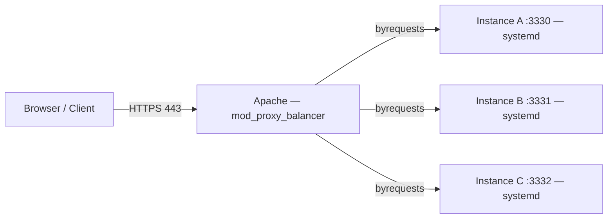

# Apache Load Balancing for a Next.js App (Horizontal Scaling)

A hands-on project extending a single-instance Apache reverse proxy into a load-balanced cluster — packaging a Next.js standalone build, deploying it as three independent systemd-managed instances, and configuring Apache's `mod_proxy_balancer` to distribute traffic across them.

## Architecture



**Solution Architect lens:** This is horizontal scaling on a single host — three isolated copies of the same release, each its own systemd unit and port, fronted by one balancer. It's the smallest possible step toward true multi-node horizontal scaling (the same pattern repeats across additional hosts) while staying cheap enough to validate locally before provisioning more infrastructure.

## 1. Build once, package as a versioned release

```bash
pnpm --filter <app-name> build
```

Assembled the standalone build output plus static assets and public files into a clean staging directory, then packaged it as a versioned, environment-tagged tarball:

```bash
tar -C ../temp-build-code -czf app-<env>-<date>-<version>.tar.gz .
```

Verified the archive contained the build artifact before deploying it anywhere:

```bash
tar -tzf app-<env>-<date>-<version>.tar.gz | grep 'apps/<app-name>/.next/BUILD_ID'
```

> **Solution Architect lens:** Naming the tarball with environment, date, and version turns every deployment into a traceable artifact — if instance B starts misbehaving, you know exactly which release it's running and can redeploy or roll back to a known-good tarball rather than rebuilding from source under pressure. Checking for `BUILD_ID` before deployment catches a broken/incomplete build before it reaches an instance folder.

## 2. Deploy the same release to three isolated instance directories

```bash
mkdir app-node-a app-node-b app-node-c

tar -xzf app-<env>-<date>-<version>.tar.gz -C app-node-a/.
tar -xzf app-<env>-<date>-<version>.tar.gz -C app-node-b/.
tar -xzf app-<env>-<date>-<version>.tar.gz -C app-node-c/.
```

Smoke-tested each instance directly before wiring it into systemd, to catch a broken build early rather than debugging through Apache:

```bash
HOSTNAME=127.0.0.1 PORT=3330 NODE_ENV=production node apps/<app-name>/server.js
curl -I http://127.0.0.1:3330
```

> **Solution Architect lens:** Deploying the identical artifact to three separate directories — rather than three separate builds — guarantees the instances are behaviorally identical. Any difference in behavior across instances is then an environment/config issue, not a code drift issue, which narrows the debugging surface considerably.

## 3. One systemd service per instance

```ini
[Unit]
Description=App Node A - Next.js
After=network.target

[Service]
Type=simple
User=appuser
WorkingDirectory=/opt/app-node-a
Environment=NODE_ENV=production
Environment=PORT=3330
Environment=PATH=/home/appuser/.nvm/versions/node/v24.15.0/bin:/usr/local/bin:/usr/bin:/bin
ExecStart=/usr/bin/node apps/<app-name>/server.js
Restart=always
RestartSec=5
KillSignal=SIGTERM
TimeoutStopSec=30
StandardOutput=journal
StandardError=journal
SyslogIdentifier=app-node-a

[Install]
WantedBy=multi-user.target
```

Repeated for nodes B (`PORT=3331`) and C (`PORT=3332`), each its own unit file and working directory.

```bash
sudo systemctl daemon-reload
sudo systemctl enable app-node-a app-node-b app-node-c
sudo systemctl start  app-node-a app-node-b app-node-c

netstat -na | grep 3330
netstat -na | grep 3331
netstat -na | grep 3332
```

> **Solution Architect lens:** Each instance is fully independent at the OS level — its own working directory, its own systemd unit, its own `Restart=always` policy. One instance crashing or being taken down for maintenance never affects the other two, which is the entire point of horizontal redundancy: no shared failure domain between replicas.

## 4. Configure Apache to load-balance across the three instances

```apacheconf
<VirtualHost *:443>
    ServerName app.example.com

    Protocols h2 http/1.1
    SSLEngine on
    SSLCertificateFile      /etc/ssl/certs/example.crt
    SSLCertificateKeyFile   /etc/ssl/certs/example.key
    SSLCertificateChainFile /etc/ssl/certs/example-chain.crt

    ProxyRequests Off
    ProxyPreserveHost On

    <Proxy "balancer://app-cluster">
        BalancerMember "http://127.0.0.1:3330" route=node-a
        BalancerMember "http://127.0.0.1:3331" route=node-b
        BalancerMember "http://127.0.0.1:3332" route=node-c
        ProxySet lbmethod=byrequests
    </Proxy>

    ProxyPass        "/" "balancer://app-cluster/"
    ProxyPassReverse "/" "balancer://app-cluster/"

    LogFormat "%h %l %u %t \"%r\" %>s %b route=%{BALANCER_WORKER_ROUTE}e" lb_combined
    CustomLog ${APACHE_LOG_DIR}/app-cluster-access.log lb_combined
</VirtualHost>
```

```bash
sudo a2enmod proxy proxy_http proxy_balancer lbmethod_byrequests slotmem_shm headers
sudo a2ensite app.example.com.conf
sudo apachectl configtest
sudo systemctl reload apache2
```

> **Solution Architect lens:** The custom `LogFormat` with `%{BALANCER_WORKER_ROUTE}e` is the detail that turns "traffic is load balanced" from an assumption into something observable — tailing the access log and watching requests rotate across `route=node-a/b/c` is the actual proof the balancer is working, not just configured. `lbmethod=byrequests` gives simple round-robin distribution; other methods (`bytraffic`, `bybusyness`) trade that simplicity for weighting by load, worth revisiting once instances aren't perfectly symmetric.

## 5. Validate distribution and instance health independently

```bash
sudo systemctl status app-node-a.service
sudo systemctl status app-node-b.service
sudo systemctl status app-node-c.service

journalctl -u app-node-a -n 50 --no-pager

sudo grep -RniE 'ProxyPass|ProxyPassReverse|BalancerMember|127\.0\.0\.1|localhost' \
  /etc/apache2/sites-enabled /etc/apache2/conf-enabled
```

> **Solution Architect lens:** Checking each instance's systemd status and journal independently — rather than only checking whether the site loads in a browser — is what catches the case where the balancer silently routes around a dead instance. Apache will happily keep serving traffic from the two healthy nodes while node C is down; without per-instance monitoring that failure is invisible until capacity runs out.

## Key takeaways

- **Build once, deploy many times.** A single versioned artifact deployed identically to every instance eliminates code drift as a variable when debugging.
- **No shared failure domain.** Separate working directories, separate systemd units, separate ports — one instance's failure never cascades to another.
- **Observability is part of the balancer, not an afterthought.** A custom log format that records which backend served each request is what makes load distribution verifiable rather than assumed.
- **This pattern scales outward, not just upward.** The same three-instances-on-one-host pattern extends directly to three instances spread across separate hosts — the balancer config barely changes.

---

*Screenshots from the original walkthrough have been omitted since they contained internal hostnames, IPs, and file paths — happy to help prep redacted versions if you want to include visuals in the repo.*
